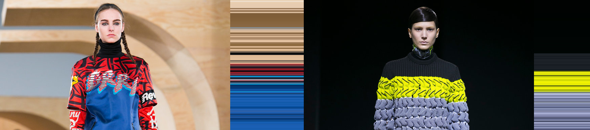
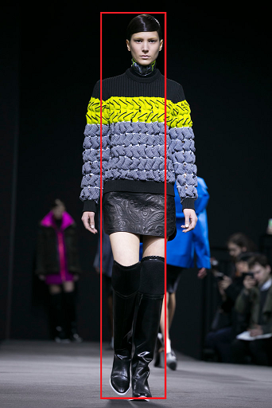

# Image Fingerprint 
-----
 

## Funcionamento

O programa analisa a imagem fornecida, obtendo a moda dos valores de cada linha de pixel presente na imagem, formando outra de mesmas dimensões. Devido a seu funcionamento é aconselhavel o recorte da imagem a ser utlizada para melhores resultados. Foram feitas duas versões, uma em python e a outra em R sendo possivel precisarem de diferentes adequações de uso devido a linguagem.

### Inspiração

Inspirado pelo texto [Create Fashion Fingerprints with R](https://www.r-bloggers.com/2014/10/create-fashion-fingerprints-with-r/ "Create Fashion Fingerprints with R").

### créditos das imagens 

As imagens foram retiradas de Inspirado pelo texto [Front Row to Fashion Week 2014](https://www.nytimes.com/newsgraphics/2014/02/14/fashion-week-editors-picks/index.html "Front Row to Fashion Week 2014")                  

